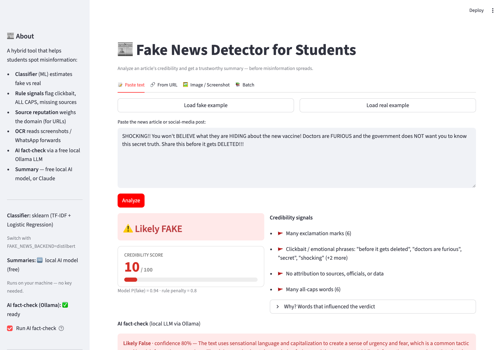
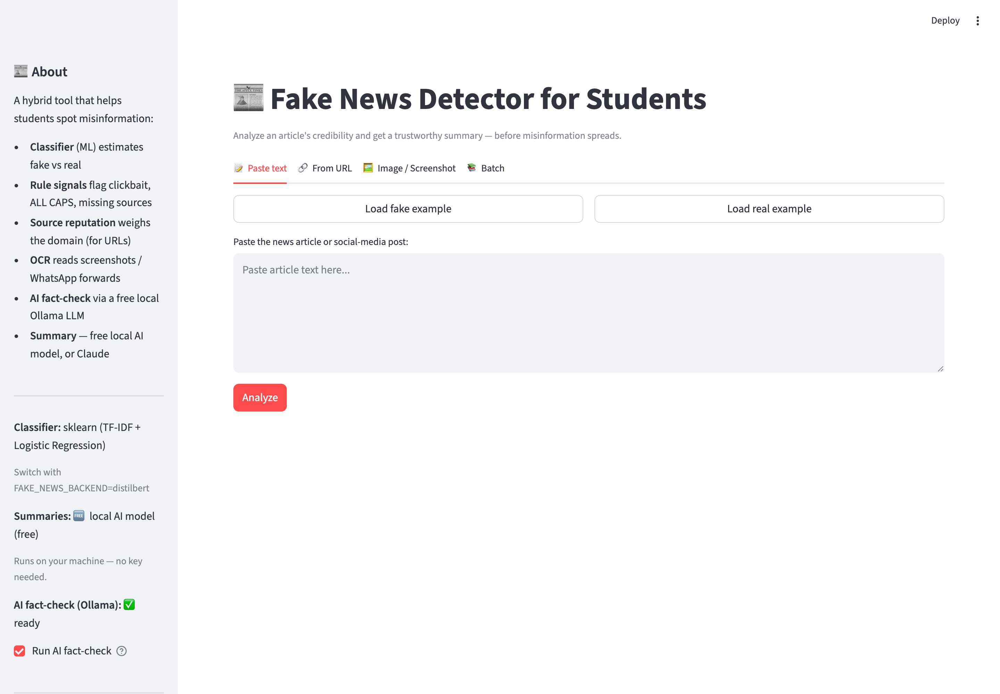

# 📰 Fake News Detector for Students

An AI system that **analyzes news articles, assesses their credibility, and produces
a concise, trustworthy summary** — helping students tell reliable information from
misinformation before it spreads.

It is a **hybrid** system by design: a fast, explainable machine-learning classifier
for the verdict, transparent rule-based signals, source-reputation weighting, and a
Claude-written summary (with a fully offline fallback).

```
            ┌─────────────┐   ┌──────────────┐   ┌───────────────────┐
  input ───▶│ ML verdict  │ + │ rule signals │ + │ source reputation │ ─▶ credibility
 (text/URL) │ TF-IDF + LR │   │ clickbait…   │   │ domain lookup     │      score 0–100
            └─────────────┘   └──────────────┘   └───────────────────┘
                                                          │
                                              Claude summary (or offline)
```

---

## 📸 Screenshots

**Analyzing a fake article** — verdict, credibility gauge, red-flag signals, and the free
local-LLM AI fact-check, all in one view:



**The app** — four input modes (text · URL · image/screenshot · batch), with live model and
backend status in the sidebar:



---

## Highlights

- **Four input modes** — paste text, fetch a live **URL**, read an **image/screenshot**
  (OCR), or **batch**-score many snippets.
- **OCR for screenshots** — upload a WhatsApp forward or social-media screenshot; the text
  is extracted (Tesseract) and analyzed like any article.
- **Pluggable classifier** — TF-IDF + Logistic Regression by default, or a fine-tuned
  **DistilBERT transformer**, behind the *same* interface (one env var switches them).
- **Free local AI fact-check** — an on-device **Ollama** LLM reasons about the claims and
  flags likely misinformation. No API key, no cost, fully offline.
- **Honestly evaluated** — 5-fold cross-validation, ROC-AUC, and a **calibration curve** +
  **Brier score**, because a "credibility score" is worthless if its probabilities lie.
- **Explainable** — every verdict shows the red flags and the exact words that drove it.
- **Source-aware** — reputable vs. flagged domains nudge the score (for URLs).
- **Runs offline** — no API keys needed; Claude summaries, the transformer, and
  fact-checking each light up when their key/model is present, and degrade gracefully.
- **Tested** — a `pytest` suite covers signals, reputation, parsing, backends, and fact-check.
- **Three interfaces** — Streamlit web app, a CLI, and a Jupyter analysis notebook.

---

## Quick start

```bash
pip install -r requirements.txt      # install dependencies
python data/make_dataset.py          # build the dataset
python src/train.py                  # train + evaluate (writes model + report plots)
streamlit run app.py                 # launch the web app
```

Open the URL Streamlit prints (usually http://localhost:8501).

### Command line

```bash
python cli.py --text "SHOCKING!! You won't believe this secret!!!"
python cli.py --url  https://en.wikipedia.org/wiki/Misinformation --summary
python cli.py --file articles.txt --json
```

### Summaries — three tiers, two of them completely free

The app picks the best available summarizer automatically:

1. **Claude** (paid) — best quality, if `ANTHROPIC_API_KEY` is set.
2. **Local AI model** — 🆓 **free**, no key. A Hugging Face `distilbart` summarizer that
   runs on your own machine (needs `pip install transformers torch`; downloads the model
   once, then works offline). This is the default when there's no Claude key.
3. **Extractive** — 🆓 free, stdlib only, always works as the final fallback.

```bash
# Free local AI summaries (no key, no cost):
pip install transformers torch
streamlit run app.py

# Force a specific tier if you like:
FAKE_NEWS_SUMMARY_MODE=local streamlit run app.py       # free local model
FAKE_NEWS_SUMMARY_MODE=extractive streamlit run app.py  # lightweight, no download
```

---

## Project structure

```
Aicte_Fake_News/
├── app.py                          # Streamlit web app (text / URL / batch)
├── cli.py                          # command-line interface
├── requirements.txt
├── data/
│   └── make_dataset.py             # builds data/news.csv (synthetic or real Kaggle)
├── src/
│   ├── config.py                   # central paths & tunables
│   ├── text_utils.py               # cleaning + rule-based credibility signals
│   ├── source_reputation.py        # domain reputation lookup
│   ├── url_fetch.py                # stdlib article extraction from a URL
│   ├── classifier.py               # pluggable backends (sklearn | distilbert)
│   ├── train.py                    # trains + rigorously evaluates the sklearn model
│   ├── train_transformer.py        # fine-tunes the optional DistilBERT backend
│   ├── predict.py                  # verdict + score + flags + explainability
│   ├── ocr.py                      # extract text from images/screenshots (Tesseract)
│   ├── ollama_check.py             # free local-LLM AI fact-check (Ollama)
│   ├── factcheck.py                # (legacy) Google Fact Check Tools lookup
│   └── summarize.py                # free local-AI summary, Claude, or extractive
├── tests/
│   └── test_pipeline.py            # pytest suite
├── notebook/
│   └── fake_news_analysis.ipynb    # training + evaluation walkthrough
├── models/                         # saved model + metrics.json (created by train.py)
└── reports/                        # confusion matrix, ROC, calibration plots
```

---

## How the credibility score works

The score (0–100, higher = more trustworthy) blends three transparent signals:

1. **Model probability** the article is real (75% weight).
2. **Rule-based penalty** from red flags — clickbait phrases, excessive capitals, many
   exclamation marks, missing sources, all-caps shouting, very short text (25% weight).
3. **Source reputation** (for URLs) — a reputable domain adds points, a flagged one
   subtracts them.

Blending keeps the tool sensible even when the model is unsure, and **every input to the
score is shown to the user**, so the verdict is explainable rather than a black box.

---

## Optional power-ups

Both are **off by default** and degrade gracefully — the core app never needs them.

### 🤖 DistilBERT transformer backend

The classifier lives behind a small Strategy interface (`src/classifier.py`), so you can
swap Logistic Regression for a fine-tuned transformer without touching the app or CLI:

```bash
pip install torch transformers            # heavy (~2 GB)
python src/train_transformer.py           # fine-tunes DistilBERT -> models/distilbert/
FAKE_NEWS_BACKEND=distilbert streamlit run app.py
```

If torch/transformers or the weights are missing, the app **automatically falls back** to
the sklearn model (and says so) — it never hard-fails.

### 🖼️ OCR — analyze screenshots & WhatsApp forwards

Misinformation often spreads as images. Upload one and the text is extracted, then
analyzed like any article.

```bash
# One-time install of an OCR engine:
brew install tesseract && pip install pytesseract      # (or: pip install easyocr)

python cli.py --image screenshot.png
# or use the "🖼️ Image / Screenshot" tab in the web app
```

### 🔎 AI fact-check with Ollama (free, local, no key)

Instead of a paid cloud API, a local LLM reasons about the article's claims and flags
likely misinformation — free, private, and offline.

```bash
# One-time setup:
#   1. Install Ollama:  https://ollama.com   (or: brew install ollama)
#   2. Pull a model:    ollama pull llama3.2
python cli.py --text "The moon is made of cheese and NASA hid it" --aicheck
# or tick "Run AI fact-check" in the web app sidebar
```

Without Ollama running it reports that it's disabled with setup steps — nothing breaks.
Pick a different model with `OLLAMA_MODEL=mistral`.

## The model & evaluation

- **Features:** TF-IDF over word 1–2 grams (topic/phrasing) **and** character 3–5 grams
  (catches obfuscation like `sp4ced` or misspelled sensational words).
- **Classifier:** Logistic Regression — linear and interpretable, so per-word
  contributions can be surfaced as explanations.
- **Evaluation** (`src/train.py`, saved to `models/metrics.json` and `reports/`):
  - Stratified **5-fold cross-validation** (accuracy + F1, mean ± std)
  - Held-out **precision / recall / F1**, **ROC-AUC**
  - **Brier score** and **log loss** — probability quality
  - Plots: **confusion matrix**, **ROC curve**, **calibration curve**

### Results

Trained and evaluated on the **real [Fake and Real News dataset](https://www.kaggle.com/datasets/clmentbisaillon/fake-and-real-news-dataset)** (44,898 articles):

| Metric | Score |
|---|---|
| 5-fold CV accuracy | 99.88% ± 0.03% |
| Held-out accuracy | 99.91% |
| ROC-AUC | 1.000 |
| Brier score | 0.0012 |

> **Why so high? An honest caveat (important for interpretation).** This dataset has a
> known *source artifact*: every "real" article comes from **Reuters** (they begin
> `WASHINGTON (Reuters) -`), while the fake ones come from other sites with different
> formatting. A classifier can therefore reach ~99.9% partly by learning *"is this
> Reuters-formatted?"* rather than *"is this true?"* — so the score reflects this dataset,
> not guaranteed generalization to unseen sources. The rule-based signals and
> source-reputation layer exist precisely to add robustness beyond the model's stylistic
> shortcuts. A stronger test is cross-source evaluation (train on one set of outlets, test
> on another) — a natural extension.

The bundled **synthetic** dataset (used automatically if the Kaggle files aren't present)
scores ≈ 0.94 CV accuracy — deliberately imperfect, with borderline cases and label noise,
so the pipeline and calibration curve are meaningful without the real data.

---

## Reproducing the real-data training

The dataset isn't committed (it's large). Fetch it and retrain in three steps:

```bash
# Easiest — kagglehub downloads the dataset to a local cache (no API token needed):
pip install kagglehub
python -c "import kagglehub, shutil, glob, os; p=kagglehub.dataset_download('clmentbisaillon/fake-and-real-news-dataset'); [shutil.copy(f,'data/') for f in glob.glob(os.path.join(p,'*.csv'))]"

python data/make_dataset.py   # auto-detects the real Fake.csv / True.csv
python src/train.py           # trains + evaluates on ~44k real articles
```

Alternatively, download `Fake.csv` + `True.csv` manually from the Kaggle page and drop them
into `data/`.

---

## Testing

```bash
pytest -q
```

Model-dependent tests auto-skip if you haven't trained yet, so the logic tests always run.

---

## Notes & possible extensions

- This is a **decision-support tool, not a definitive fact-checker** — always pair it with
  cross-checking against trusted sources.
- Natural next steps: a larger curated source-reputation list, claim-level evidence
  retrieval, attention-based explanations for the transformer, and multilingual support.

---

## License

Released under the [MIT License](LICENSE) — free to use, modify, and share.

## Author

**Aman Kumar** · [@AmanKumar-23](https://github.com/AmanKumar-23)
